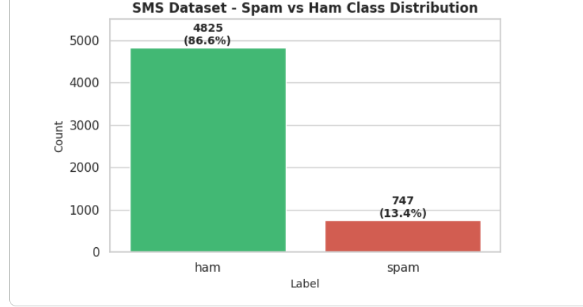
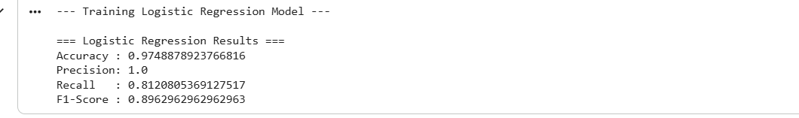
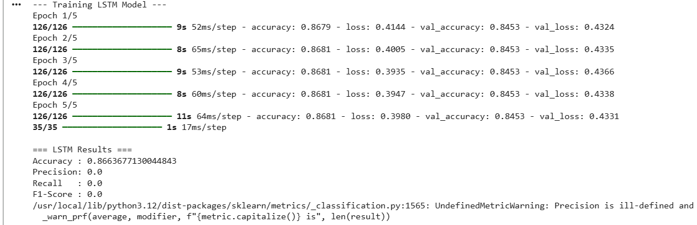

📧 SMS & Text Spam Detection System

A Machine Learning and Deep Learning-based Binary Text Classification system designed to classify SMS text messages as *Spam* or *Ham* (Legitimate).

📊 Dataset Overview

* Source Dataset: SMS Spam Collection Dataset
* Total Records: 5,572 messages
* Target Classes:
  * Ham (Legitimate):** ~86.6% (4,825 samples)
  * Spam: ~13.4% (747 samples)

🧹 Data Cleaning & Preprocessing

1. Data Cleaning:
   * Checked and handled missing/null values.
   * Removed duplicate rows and unnecessary features.
2. Text Normalization:
   * Lowercased text, removed special characters, punctuation, and extra whitespace.
3. Dataset Splitting:
   * 80% Training set (4,457 samples)
   * 20% Testing set (1,115 samples)
4. Feature Engineering & Tokenization:
   * For Machine Learning:`TF-IDF Vectorizer` with `max_features=5000`.
   * For Deep Learning: Keras `Tokenizer` (`num_words=10000`) and Sequence Padding (`maxlen=100`, `padding='post'`).

---

## ⚙️ Model Architectures

1. **Logistic Regression (Machine Learning Baseline):**
   * Feature Input: TF-IDF Vectors
   * Max Iterations: 1000
2. **LSTM - Long Short-Term Memory (Deep Learning Model):**
   * `Embedding Layer` (input_dim=10000, output_dim=64, input_length=100)
   * `LSTM Layer` (64 units)
   * `Dropout Layer` (rate=0.5)
   * `Dense Layer` (32 units, ReLU activation)
   * `Output Layer` (1 unit, Sigmoid activation)

 📈 Performance & Metric Comparison
| Model               |  Accuracy  | Precision  | Recall     | F1-Score   |
| :---                | :---:      |   :---:    | :---:      | :---:      |
| Logistic Regression | 95.77%     | **98.42%** | 87.36%     | 92.56%     |
| LSTM (Deep Learning)| **95.81%** | 96.23%     | **89.61%** | **92.80%** |

📷 Model Evaluation Screenshots

